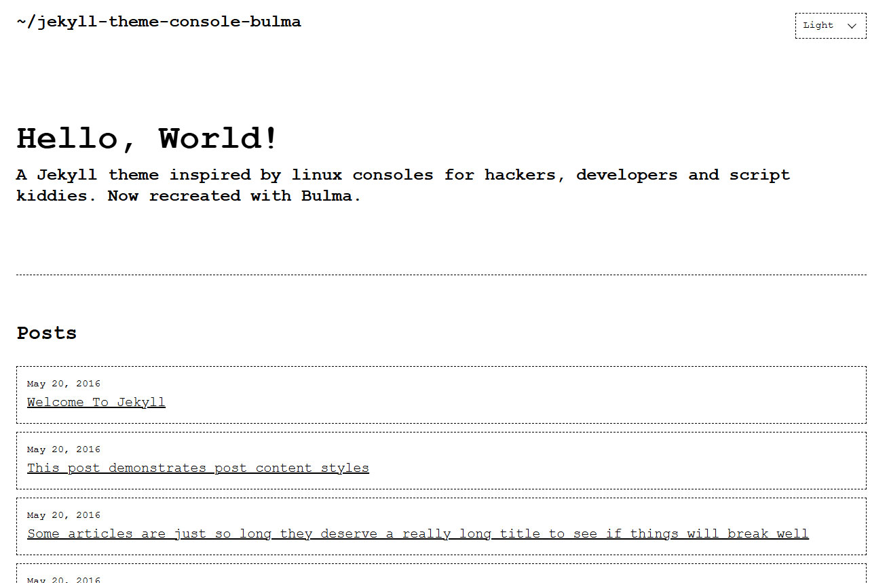
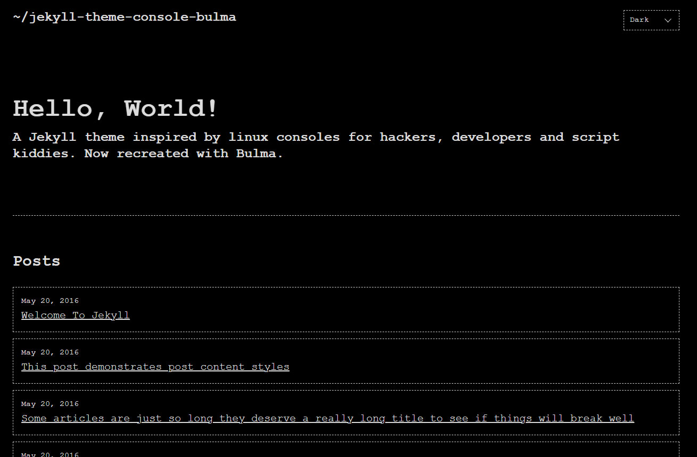
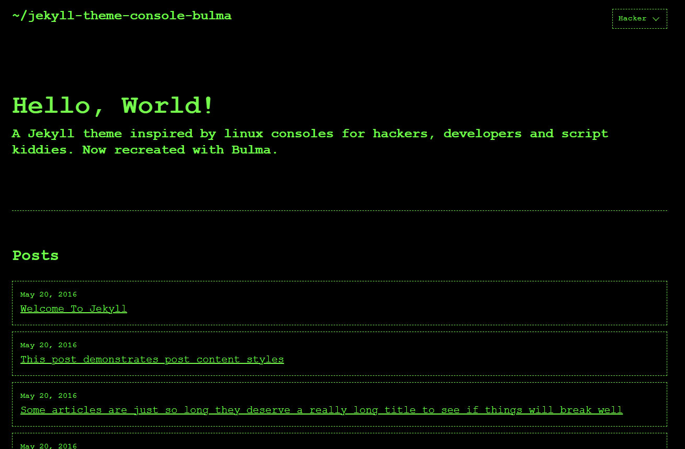
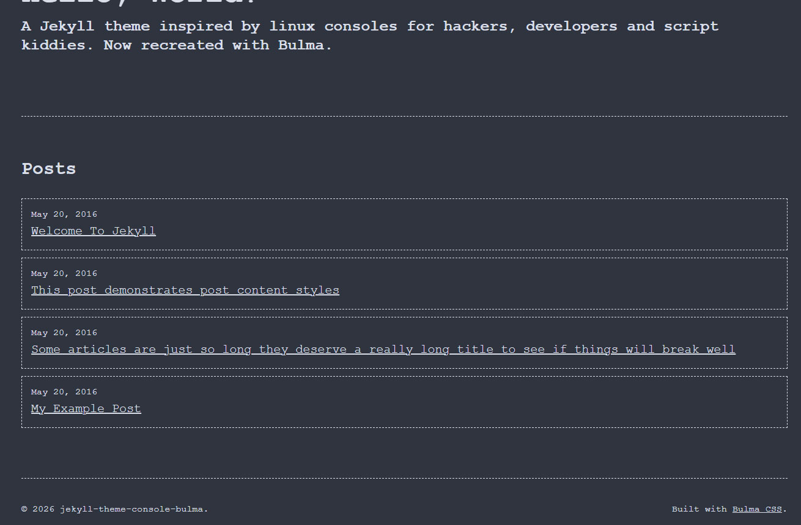

# jekyll-theme-console-bulma

*Terminal-inspired Jekyll theme. Bulma-powered, retro-styled, hacker-approved.*

| Light | Dark |
|-------|------|
|  |  |

| Hacker | Nord |
|--------|------|
|  |  |

## Installation

Add this line to your Jekyll site's `Gemfile`:

```ruby
gem "jekyll-theme-console-bulma"
```

And set the theme in your `_config.yml`:

```yaml
theme: jekyll-theme-console-bulma
```

Then run:

```
bundle install
```

## Usage

### Layouts

- `default.html` — Base layout. All other layouts inherit from this.
- `home.html` — Landing page. Renders `index.md` content followed by a post list.
- `page.html` — Standard page with title and content.
- `post.html` — Blog post with title, date, optional author, and optional Disqus comments.

### Includes

- `head.html` — `<head>` block. Loads Bulma CSS, theme styles, and SEO tags.
- `header.html` — Site title and theme switcher dropdown.
- `footer.html` — Copyright year and attribution.
- `disqus_comments.html` — Disqus comment box (optional).
- `google-analytics.html` — Google Analytics (production only, optional).

### Sass

- `_sass/jekyll-theme-console-bulma.scss` — Entry point.
- `_sass/jekyll-theme-console-bulma/_variables.scss` — CSS custom properties for all color themes.
- `_sass/jekyll-theme-console-bulma/_base.scss` — Body, typography, links, selection.
- `_sass/jekyll-theme-console-bulma/_layout.scss` — Container, header, footer, responsive breakpoint.
- `_sass/jekyll-theme-console-bulma/_components.scss` — Bulma overrides, code blocks, site-title.

### Assets

- `assets/main.scss` — Compiled to `assets/main.css` by Jekyll.
- `assets/css/bulma.min.css` — Local Bulma CSS (no CDN dependency).
- `assets/js/theme-switcher.js` — Theme switcher with localStorage persistence.

## Configuration

Add any of the following to your `_config.yml`:

```yaml
# Site
title: Your Site Title
description: Your site description.
url: https://yoursite.com

# Theme switcher default (light, dark, hacker, nord)
# Users can change this via the dropdown — preference is saved in localStorage

# Disqus comments
disqus:
  shortname: your_disqus_shortname

# Google Analytics (production only)
google_analytics: UA-NNNNNNNN-N
```

## Color Themes

Four palettes are included out of the box, switchable via the dropdown in the header:

| Theme | Background | Accent |
|-------|-----------|--------|
| Light | `#fff` | `#000` |
| Dark | `#000` | `#dbdbdb` |
| Hacker | `#000` | `#00ff00` |
| Nord | `#2e3440` | `#d8dee9` |

To add a custom palette, override `_sass/jekyll-theme-console-bulma/_variables.scss`
in your site and add a new `[data-theme="your-name"]` block.

## Customization

Any theme file can be overridden locally. Copy the file you want to change into
the matching directory in your site root and edit it — Jekyll will use your
version instead of the gem's.

```
# Example: override just the footer
cp $(bundle show jekyll-theme-console-bulma)/_includes/footer.html _includes/footer.html
```

## Contributing

Bug reports and pull requests are welcome on GitHub at
https://github.com/retromatter/jekyll-theme-console-bulma.

This project is intended to be a safe, welcoming space for collaboration.
Contributors are expected to adhere to the [Contributor Covenant](http://contributor-covenant.org) code of conduct.

## License

The theme is available as open source under the terms of the [MIT License](LICENSE.txt).
